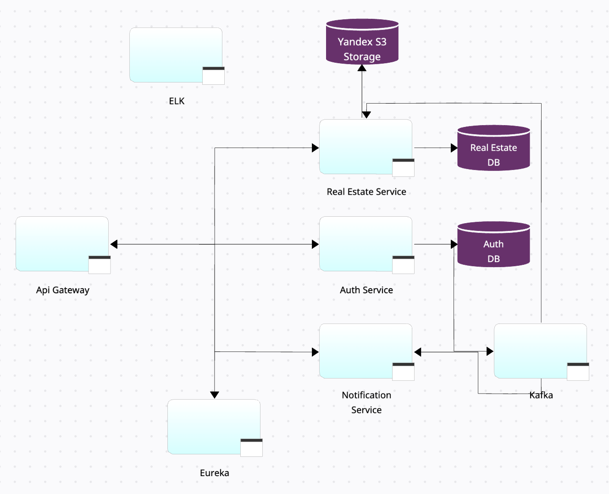
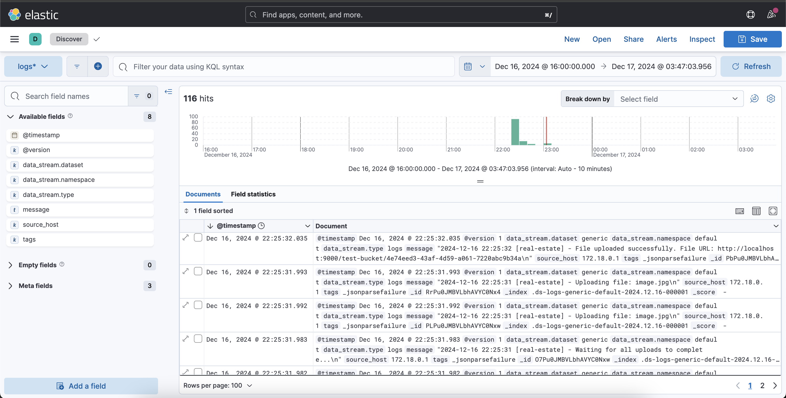

# Платформа для продажи и аренды недвижимости

Это курсовой проект, реализующий платформу для продажи и аренды недвижимости. Платформа позволяет пользователям искать недвижимость, добавлять объявления о продаже или аренде, а также взаимодействовать с системой с помощью аутентификации и уведомлений.

## Описание

Система включает следующие основные компоненты:

- **Регистрация и аутентификация пользователей** (с использованием access и refresh токена).
- **Поиск недвижимости** с фильтрацией по различным параметрам (цена, дата, город, ключевое слово, тип недвижимости, и т.д.).
- **Добавление недвижимости** с возможностью загрузки изображений.
- **Уведомления по электронной почте** связанные с успешной регистрацией.
- **Удаление аккаунта** с удалением всех связанных данных (в том числе объявлений).

## Стек технологий

- **Backend**:
    - Java 21
    - Spring Boot
    - Spring Security
    - Spring Data JPA
    - Hibernate Search (Lucene)
    - PostgreSQL
    - Kafka
    - Docker / Docker Compose
    - Liquibase
    - ELK Stack (Elasticsearch, Logstash, Kibana) для логирования

- **Тестирование**:
    - JUnit 5
    - Mockito
    - Testcontainers

## Архитектура

## ELK

