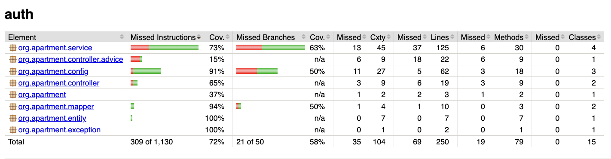
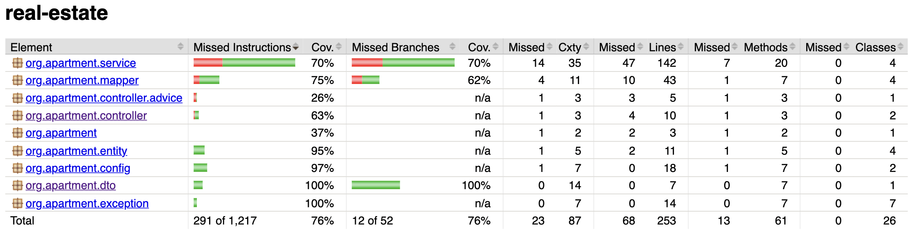

# Платформа для продажи и аренды недвижимости

Данный проект представляет собой веб-платформу для размещения и поиска объектов недвижимости. Система предоставляет возможность публиковать объявления о продаже и аренде, а также осуществлять поиск по различным критериям. Реализована функциональность пользовательского взаимодействия, включая аутентификацию и уведомления об успешной регистрации.

## Основные возможности

- **Регистрация и аутентификация пользователей** с применением access и refresh токенов.
- **Поиск объектов недвижимости** с фильтрацией по параметрам: цена, дата, город, ключевые слова, тип недвижимости и др.
- **Размещение объявлений** с возможностью загрузки изображений.
- **Уведомления по электронной почте**, включая подтверждение успешной регистрации.
- **Удаление аккаунта** с полным удалением связанных данных, включая объявления.

## Стек технологий

- **Backend**:
    - Java 21
    - Spring Boot
    - Spring Security
    - Spring Data JPA
    - Hibernate Search (Lucene)
    - PostgreSQL
    - Kafka
    - Docker / Docker Compose
    - Liquibase
    - ELK Stack (Elasticsearch, Logstash, Kibana) для логирования

- **Тестирование**:
    - JUnit 5
    - Mockito
    - Testcontainers

## Архитектура

## ELK

## Покрытие тестами

Для ci/cd установлен минимальный уровень покрытия тестами в 70%
